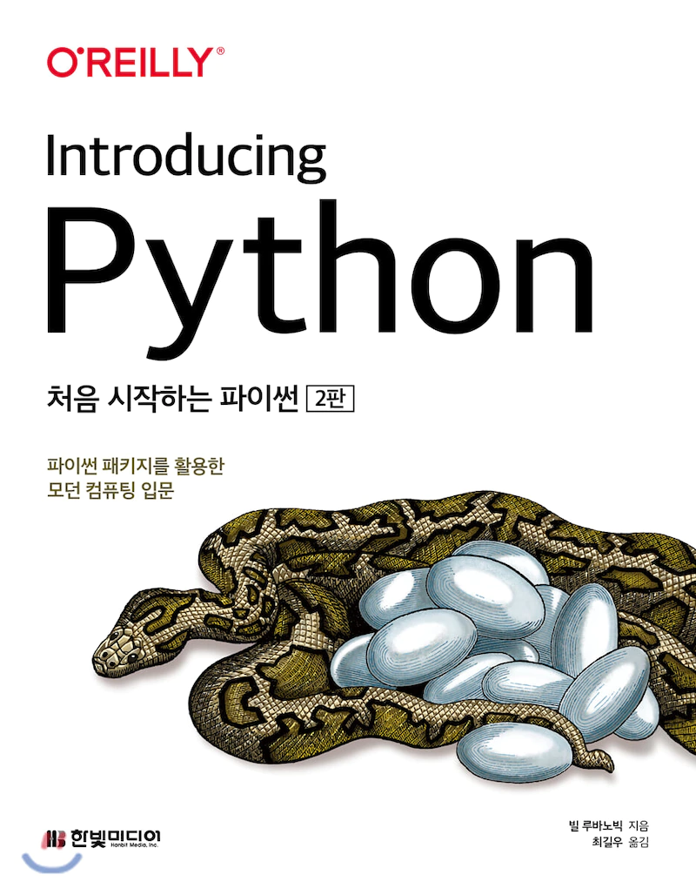

# Introducing Python

처음 시작하는 파이썬: 파이썬 패키지를 활용한 모던 컴퓨터 입문

<kbd></kbd>

## 목차
### Part I 파이썬 기초

#### chapter 1 파이(py) 맛보기
> 1.1 미스터리
>
> 1.2 작은 프로그램
>
> 1.3 조금 더 큰 프로그램
>
> 1.4 파이썬 활용
>
> 1.5 파이썬과 다른 언어
>
> 1.6 왜 파이썬인가?
>
> 1.7 상황에 따른 파이썬
>
> 1.8 파이썬 2와 파이썬 3
>
> 1.9 파이썬 설치하기
>
> 1.10 파이썬 실행하기
>
> 1.11 파이썬 철학
>
> 1.12 다음 장에서는
>
> 1.13 연습문제

#### chapter 2 데이터: 타입, 값, 변수, 이름
> 2.1 파이썬 데이터는 객체다
>
> 2.2 타입
>
> 2.3 가변성
>
> 2.4 리터럴 값
>
> 2.5 변수
>
> 2.6 할당
>
> 2.7 변수는 장소가 아니라 이름이다
>
> 2.8 여러 이름 할당하기
>
> 2.9 이름 재할당
>
> 2.10 복사
>
> 2.11 좋은 변수 이름
>
> 2.12 다음 장에서는
>
> 2.13 연습문제

#### chapter 3 숫자

> 3.1 불리언
>
> 3.2 정수
>
> 3.3 부동소수점 숫자
>
> 3.4 수학 함수
>
> 3.5 다음 장에서는
>
> 3.6 연습문제

#### chapter 4 선택하기: if

> 4.1 주석 달기: #
>
> 4.2 라인 유지하기: \
>
> 4.3 비교하기: if, elif, else
>
> 4.4 True와 False
>
> 4.5 여러 개 비교하기: in
>
> 4.6 새로운 기능: 바다코끼리 연산자
>
> 4.7 다음 장에서는
>
> 4.8 연습문제

#### chapter 5 텍스트 문자열

> 5.1 따옴표로 문자열 생성
>
> 5.2 문자열 타입으로 변환: str()
>
> 5.3 이스케이프 문자: \
>
> 5.4 결합하기: +
>
> 5.5 복제하기: *
>
> 5.6 문자 추출: [ ]
>
> 5.7 슬라이스로 부분 문자열 추출
>
> 5.8 문자열 길이: len()
>
> 5.9 문자열 나누기: split()
>
> 5.10 문자열 결합하기: join()
>
> 5.11 문자열 대체하기: replace()
>
> 5.12 문자열 스트립: strip()
>
> 5.13 검색과 선택
>
> 5.14 대소 문자
>
> 5.15 정렬
>
> 5.16 포매팅
>
> 5.17 더 많은 문자열 메서드
>
> 5.18 다음 장에서는
>
> 5.19 연습문제

#### chapter 6 반복문: while과 for 문

> 6.1 반복하기: while
>
> 6.2 순회하기: for와 in
>
> 6.3 기타 이터레이터
>
> 6.4 다음 장에서는
>
> 6.5 연습문제

#### chapter 7 튜플과 리스트

> 7.1 튜플
>
> 7.2 리스트
>
> 7.3 튜플 vs 리스트
>
> 7.4 튜플 컴프리헨션은 없다
>
> 7.5 다음 장에서는
>
> 7.6 연습문제

#### chapter 8 딕셔너리와 셋

> 8.1 딕셔너리
>
> 8.2 셋
>
> 8.3 지금까지 배운 자료구조
>
> 8.4 자료구조 결합하기
>
> 8.5 다음 장에서는
>
> 8.6 연습문제

#### chapter 9 함수

> 9.1 함수 정의하기: def
>
> 9.2 함수 호출하기: ()
>
> 9.3 인수와 매개변수
>
> 9.4 독스트링
>
> 9.5 일등 시민: 함수
>
> 9.6 내부 함수
>
> 9.7 익명 함수: lambda
>
> 9.8 제너레이터
>
> 9.9 데커레이터
>
> 9.10 네임스페이스와 스코프
>
> 9.11 이름에 _와 __ 사용하기
>
> 9.12 재귀 함수
>
> 9.13 비동기 함수
>
> 9.14 예외
>
> 9.15 다음 장에서는
>
> 9.16 연습문제

#### chapter 10 객체와 클래스

> 10.1 객체란 무엇인가?
>
> 10.2 간단한 객체
>
> 10.3 상속
>
> 10.4 자신: self
>
> 10.5 속성 접근
>
> 10.6 메서드 타입
>
> 10.7 덕 타이핑
>
> 10.8 매직 메서드
>
> 10.9 애그리게이션과 콤퍼지션
>
> 10.10 객체는 언제 사용할까?
>
> 10.11 네임드 튜플
>
> 10.12 데이터 클래스
>
> 10.13 attrs
>
> 10.14 다음 장에서는
>
> 10.15 연습문제

#### chapter 11 모듈과 패키지

> 11.1 모듈과 import 문
>
> 11.2 패키지
>
> 11.3 파이썬 표준 라이브러리
>
> 11.4 배터리 장착: 다른 파이썬 코드 가져오기
>
> 11.5 다음 장에서는
>
> 11.6 연습문제

### Part II 파이썬 실전

#### chapter 12 데이터 길들이기

> 12.1 텍스트 문자열: 유니코드
>
> 12.2 정규 표현식
>
> 12.3 이진 데이터
>
> 12.4 보석 비유
>
> 12.5 다음 장에서는
>
> 12.6 연습문제

#### chapter 13 날짜와 시간

> 13.1 윤년
>
> 13.2 datetime 모듈
>
> 13.3 time 모듈
>
> 13.4 날짜와 시간 읽고 쓰기
>
> 13.5 시간 모듈 변환
>
> 13.6 대체 모듈
>
> 13.7 다음 장에서는
>
> 13.8 연습문제

#### chapter 14 파일과 디렉터리

> 14.1 파일 입출력
>
> 14.2 메모리 매핑
>
> 14.3 파일 명령어
>
> 14.4 디렉터리 명령어
>
> 14.5 경로 이름
>
> 14.6 BytesIO와 StringIO
>
> 14.7 다음 장에서는
>
> 14.8 연습문제

#### chapter 15 프로세스와 동시성

> 15.1 프로그램과 프로세스
>
> 15.2 명령 자동화
>
> 15.3 동시성
>
> 15.4 다음 장에서는
>
> 15.5 연습문제

#### chapter 16 파일과 데이터베이스

> 16.1 플랫 텍스트 파일
>
> 16.2 패디드 텍스트 파일
>
> 16.3 표 형식 텍스트 파일
>
> 16.4 이진 파일
>
> 16.5 관계형 데이터베이스
>
> 16.6 NoSQL 데이터 스토어
>
> 16.7 풀 텍스트 데이터베이스
>
> 16.8 다음 장에서는
>
> 16.9 연습문제

#### chapter 17 네트워크

> 17.1 TCP/IP
>
> 17.2 네트워크 패턴
>
> 17.3 요청-응답 패턴
>
> 17.4 발행-구독 패턴
>
> 17.5 인터넷 서비스
>
> 17.6 웹 서비스와 API
>
> 17.7 데이터 직렬화
>
> 17.8 원격 프로시저 호출
>
> 17.9 원격 관리 도구
>
> 17.10 빅데이터
>
> 17.11 클라우드
>
> 17.12 도커
>
> 17.14 다음 장에서는
>
> 17.15 연습문제

#### chapter 18 웹

> 18.1 웹 클라이언트
>
> 18.2 웹 서버
>
> 18.3 웹 서버 프레임워크
>
> 18.4 데이터베이스 프레임워크
>
> 18.5 웹 서비스와 자동화
>
> 18.6 웹 API와 REST
>
> 18.7 크롤링과 스크래핑
>
> 18.8 영화 검색 예제
>
> 18.9 다음 장에서는
>
> 18.10 연습문제

#### chapter 19 파이써니스타 되기

> 19.1 프로그래밍이란
>
> 19.2 파이썬 코드 찾기
>
> 19.3 패키지 설치
>
> 19.4 IDE
>
> 19.5 이름과 문서
>
> 19.6 타입 힌트
>
> 19.7 테스트
>
> 19.8 코드 디버깅
>
> 19.9 로그 에러 메시지
>
> 19.10 코드 최적화
>
> 19.11 소스 컨트롤
>
> 19.12 프로그램 배포
>
> 19.13 이 책의 소스 코드
>
> 19.14 더 배우기
>
> 19.15 다음 장에서는
>
> 19.16 연습문제

#### chapter 20 파이 아트

> 20.1 2D 그래픽
>
> 20.2 3D 그래픽
>
> 20.3 3D 애니메이션
>
> 20.4 GUI
>
> 20.5 플롯, 그래프, 시각화
>
> 20.6 게임
>
> 20.7 소리와 음악
>
> 20.8 다음 장에서는
>
> 20.9 연습문제

#### chapter 21 파이 비즈니스

> 21.1 MS 오피스
>
> 21.2 비즈니스 업무
>
> 21.3 비즈니스 데이터 처리
>
> 21.4 오픈 소스 파이썬 비즈니스 패키지
>
> 21.5 금융과 파이썬
>
> 21.6 데이터 보안
>
> 21.7 지도
>
> 21.8 다음 장에서는
>
> 21.9 연습문제

#### chapter 22 파이 과학

> 22.1 수학 및 통계 표준 라이브러리
>
> 22.2 과학과 파이썬
>
> 22.3 넘파이
>
> 22.4 사이파이
>
> 22.5 사이킷
>
> 22.6 판다스
>
> 22.7 파이썬과 과학 분야
>
> 22.8 다음 장에서는
>
> 22.9 연습문제

#### 부록 A 하드웨어와 소프트웨어

#### 부록 B 파이썬 3 설치

#### 부록 C 완전히 다른 것: Async

#### 부록 D 연습문제 정답

#### 부록 E 커닝페이퍼
